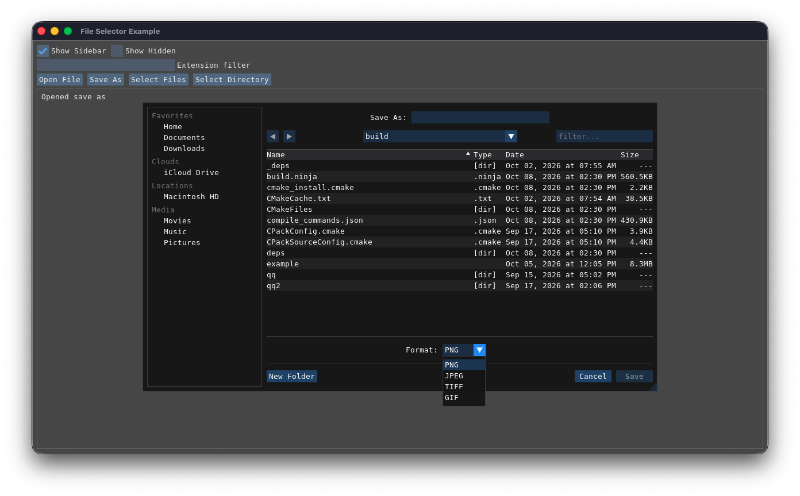

## Accessory Views

 Accessory views are supplementary user interface elements added to the
 standard file selector to extend the functionality. They allow you to insert
 custom buttons, checkboxes, text fields, or complex layouts into the selector.
 They are implemented as optional callbacks on the 4 methods that open a
 file selector. Here is the SaveAs method as an example:

 ``` c++
	bool SaveAs(
		const std::filesystem::path& defaultPath={},	// the default
		std::function<void()> accessoryView={}, 		// accessory view callback responsible for rendering and state management
		float avHeight=0.0f								// height of the accessory view between directory listing and action buttons
	);
 ```



The screenshot above shows the Save As file selector that does not only
let the user select the target file but also the file format through
an accessory view. Below are code snippet to implement this and you can see
it in action in the [example application](../example).

```c++
	// somewhere in a class in your app
	static constexpr const char* formats[] = { "PNG", "JPEG", "TIFF", "GIF" };
	static constexpr const char* formatExtensions[] = { ".png", ".jpeg", ".tiff", ".gif" };
	static constexpr size_t formatCount = sizeof(formats) / sizeof(formats[0]);
	size_t selectedFormat = 0;


	// somewhere in the applications UI, we need to open thew file selector
	// here we use a push button or a keyboard shortcut
	if (ImGui::Button("Save As") || ImGui::Shortcut(ImGuiMod_Ctrl | ImGuiKey_S)) {
		selector.SaveAs({}, [this]() {
			// this callback is called every frame and its job in the render the accessory view
			auto pos = ImGui::GetCursorScreenPos();
			auto glyphWidth = ImGui::CalcTextSize("#").y;
			auto selectorWidth = glyphWidth * 5.0f;
			auto totalWidth = (7.0f * glyphWidth) + ImGui::GetStyle().ItemSpacing.x + selectorWidth;
			ImGui::SetCursorScreenPos(ImVec2(pos.x + (ImGui::GetContentRegionAvail().x - totalWidth) * 0.5f, pos.y));
			ImGui::AlignTextToFramePadding();
			ImGui::TextUnformatted("Format:");
			ImGui::SameLine();
			ImGui::SetNextItemWidth(selectorWidth);

			// in this case, we use a centered combobox to let the user pick a format type
			if (ImGui::BeginCombo("###format", formats[selectedFormat])) {
				for (size_t i = 0; i < formatCount; i++) {
					const auto isSelected = (selectedFormat == i);

					if (ImGui::Selectable(formats[i], isSelected)) {
						selectedFormat = i;
						selector.SetSelectedExtension(formatExtensions[i]);
					}

					if (isSelected) {
						ImGui::SetItemDefaultFocus();
					}
				}

				ImGui::EndCombo();
			}

		}, ImGui::GetFrameHeight()); // the last parameter in the amount of vertical space the accessory view takes
	}


	// in the Dear ImGui rendering loop, handle the file selector
	if (selector.Render()) {
		if (selector.SelectedSaveAs()) {
			// tell the selector what the extension for the selected file is
			selector.SetSelectedExtension(formatExtensions[selectedFormat]);

			// get the full path name
			auto targetPath = selector.GetSelectedPath();

			// add some logic to save the file
		}
	}
```